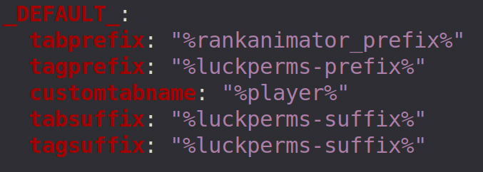

# RankAnimator

A lightweight Paper plugin that brings animated prefixes to your tablist. Define your own animations in a simple config, map them to LuckPerms groups, and let PlaceholderAPI handle the rest — no TAB API hacks, no display name interference.


---

## How it works

RankAnimator runs a tick-based engine that cycles through animation frames for each online player. The current frame is exposed as a PlaceholderAPI placeholder (`%rankanimator_prefix%`), which you drop into TAB's `groups.yml`. TAB reads it on its own refresh cycle and displays it in the tablist — your player's name stays completely untouched.

---

## Requirements

| Plugin | Version | Download |
|--------|---------|----------|
| [Paper](https://papermc.io/downloads/paper) | 1.21.1+ | — |
| [LuckPerms](https://github.com/LuckPerms/LuckPerms) | 5.x | [GitHub](https://github.com/LuckPerms/LuckPerms) |
| [TAB](https://github.com/NEZNAMY/TAB) | 6.x | [GitHub](https://github.com/NEZNAMY/TAB) |
| [PlaceholderAPI](https://github.com/PlaceholderAPI/PlaceholderAPI) | 2.11+ | [GitHub](https://github.com/PlaceholderAPI/PlaceholderAPI) |

---

## Installation

1. Download the [latest release](https://github.com/<USER>/<REPO>/releases/latest)
2. Drop `RankAnimator.jar` into your `plugins/` folder alongside TAB, LuckPerms, and PlaceholderAPI.
3. Start the server once to generate the config files.
4. Define your animations in `plugins/RankAnimator/animations.yml`.
5. Map your LuckPerms groups to animations in `plugins/RankAnimator/config.yml`.
6. Set the placeholder in TAB's `plugins/TAB/groups.yml` (see below).
7. Run `/ra reload`.

---

## TAB Setup

Open `plugins/TAB/groups.yml` and set `tabprefix` to the RankAnimator placeholder:

```yaml
_DEFAULT_:
  tabprefix: "%rankanimator_prefix%"
  tabsuffix: ""
```



> Make sure you end every animation frame with `&r` so the color doesn't bleed into the player name that TAB renders after the prefix.

---

## Configuration

### `config.yml`

```yaml
enabled: true
update-interval: 1  # ticks between frame checks (1 tick = 50ms)

# Map LuckPerms group names to animation names defined in animations.yml.
# Group names are case-insensitive.
groups:
  owner:
    animation: owner_flash
  developer:
    animation: developer_spotlight

# Shown when a player's group has no animation mapped.
# Leave empty to fall back to TAB's own prefix handling.
fallback-prefix: ""
```

### `animations.yml`

```yaml
animations:
  owner_flash:
    interval: 5        # ticks between frames (20 ticks = 1 second)
    frames:
      - "&4[&6OWNER&4]&r "
      - "&6[&eOWNER&6]&r "
      - "&4[&6OWNER&4]&r "

  developer_spotlight:
    interval: 5
    frames:
      - "&4[&6D&4EVELOPER]&r "
      - "&4[D&6E&4VELOPER]&r "
      - "&4[DE&6V&4ELOPER]&r "
      - "&4[DEV&6E&4LOPER]&r "
      - "&4[DEVE&6L&4OPER]&r "
      - "&4[DEVEL&6O&4PER]&r "
      - "&4[DEVELO&6P&4ER]&r "
      - "&4[DEVELOP&6E&4R]&r "
      - "&4[DEVELOPE&6R&4]&r "
      - "&4[DEVELOPER]&r "
```

**Color codes:** `&0`–`&9`, `&a`–`&f`  
**Formatting:** `&l` Bold · `&o` Italic · `&m` Strike · `&k` Magic · `&r` Reset

---

## Commands

| Command | Description | Permission |
|---------|-------------|------------|
| `/ra reload` | Reload both config files | `rankanimator.admin` |
| `/ra refresh [player]` | Re-assign animation(s) from LuckPerms | `rankanimator.admin` |
| `/ra info` | Show loaded animations and active players | `rankanimator.admin` |

---

## Performance note

RankAnimator runs one server-side tick task that updates frame state in memory. TAB then reads the placeholder on its own schedule — there's no packet spam or per-player tasks.

That said, **animating every group on a large server will cause TPS drops.** The animation engine loops over every tracked player each tick, and the more players you have with animations running, the more work it does. Keep animations limited to high-privilege groups like Owner, Admin, and Developer. For regular players and large groups like VIP or Member, either leave them unanimated or use a static prefix through TAB's own `groups.yml` instead.

---

## License

MIT
